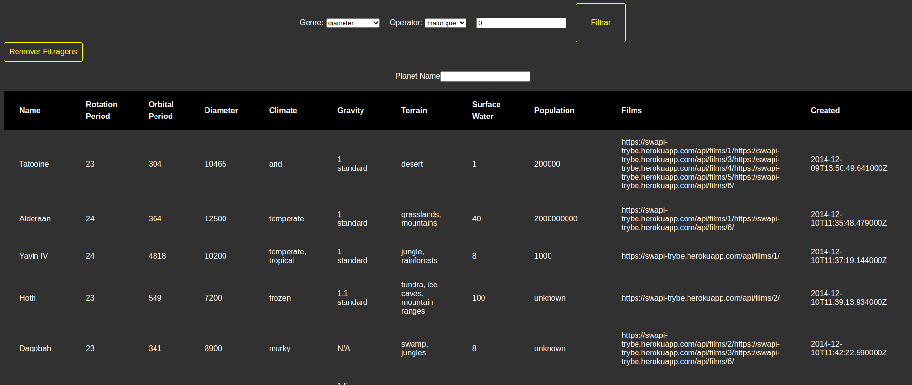

# Project StarWars Planets

This project was developed at the Trybe course, with React and Context API.

  

## About the project:

In this project i was able to test my abilities with React and Context, using
functional components, hooks and context API for the first time.

Its a simple table, with data about the planets in Star Wars and a little information
about them. You can filter by name, genre and quantity, and you can also remove the filters.

## How to start this project:

Clone this repository.

In the project directory, you can run:

npm install, than npm start.

Open http://localhost:3000 to view it in the browser.

---

Made by Igor Mazetti 👋 [See my linkedin](https://www.linkedin.com/in/igor-mazetti-de-azevedo-147679ba/)
